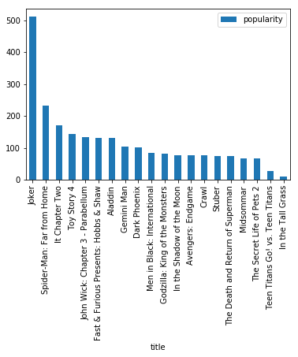

# MoviesDB-GetTrailer
This is a really fun project Python to extract data using API calls and to get movie posters, trailers and display popular movies in a histogram. This is part of my learning journey at  NUS ISS where I attended a course NICF- Python for Data, Ops and Things. The skills learnt here really helped to pave the way towards learning how to extract Data and use Panda library to represent the data in a table format, and plot a histogram. Along the way, I learnt so many interesting features of Python, in particular, I would like to share in this repository, how to display youtube trailers using a drop down list of titles. A really cool thing to do. All the work done here is made possible by The Movie Database(TMDb). In addition, the libraries I used here is Pandas, which I used to display the data I extracted in JSON format to a table and visualise it in a graph.

What is the most popular movie?

Many thanks to our wonderful instructor, Bala and everyone in the course. This is my playground, where I learn to play with Python code. Thanks for reading and sharing my learning journey. Its been a joy to learn and grow together. I love github where everyone can learn together and grow stronger and better everyday.

'I remember the teachers that changed my life, because they believed in me when I didn't believe in myself.'

